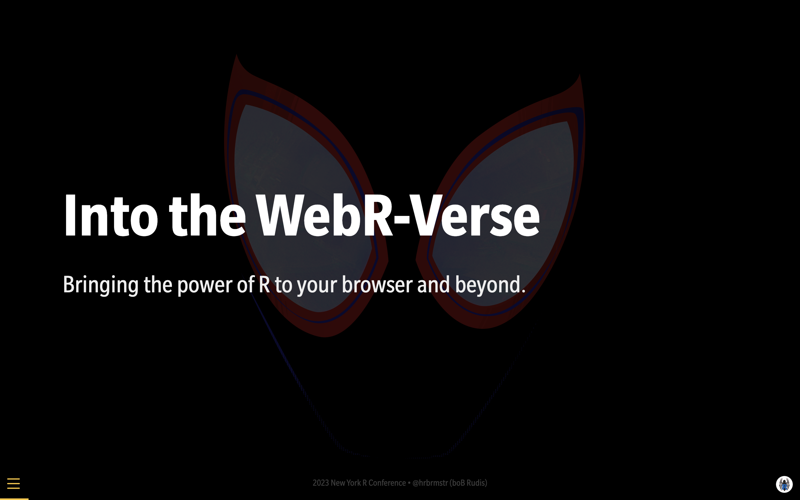

Slides (source) for my 2023 New York R Talk "Into The WebR-Verse"

- `fonts/` has fonts you'll need to install locally for best viewing.
- `webr.qmd` needs to be rendered first
- then you can render the main presentation.

